<p align="center">
  
</p>

<h1 align="center">Run4Tree 🌱🏃</h1>

Run4Tree é um aplicativo Flutter de corrida, caminhada e ciclismo que transforma atividade física e receita de anúncios em progresso para o plantio de árvores reais.

Esta é a edição open source do projeto. Ela mantém a experiência individual e os recursos essenciais do aplicativo; módulos sociais e operacionais proprietários não fazem parte deste repositório.

## Baixe o aplicativo oficial

A versão oficial e completa do Run4Tree está disponível na Google Play:

[Baixar o Run4Tree na Google Play](https://play.google.com/store/apps/details?id=com.run4tree.app)

## Veja o Run4Tree em ação

Clique na imagem para assistir à demonstração no YouTube:

<p align="center">
  <a href="https://www.youtube.com/shorts/NXp-ivzOAGs">
    
  </a>
</p>

[Assistir ao vídeo no YouTube](https://www.youtube.com/shorts/NXp-ivzOAGs)

## Imagens do aplicativo oficial

As capturas abaixo apresentam a experiência completa disponível no aplicativo oficial. Alguns recursos exibidos, como desafios em grupo e floresta global, não fazem parte desta edição open source.

<table>
  <tr>
    <td align="center">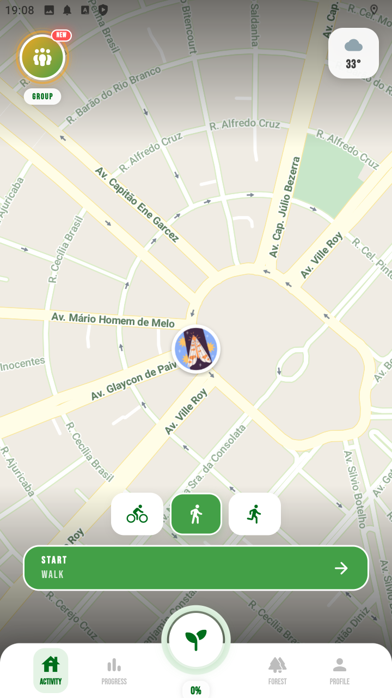<br><sub>Mapa e atividade</sub></td>
    <td align="center">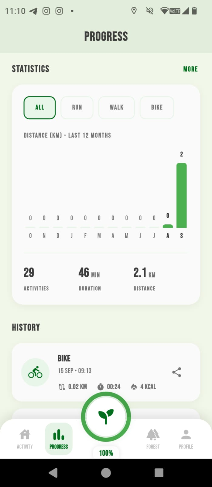<br><sub>Progresso e histórico</sub></td>
    <td align="center">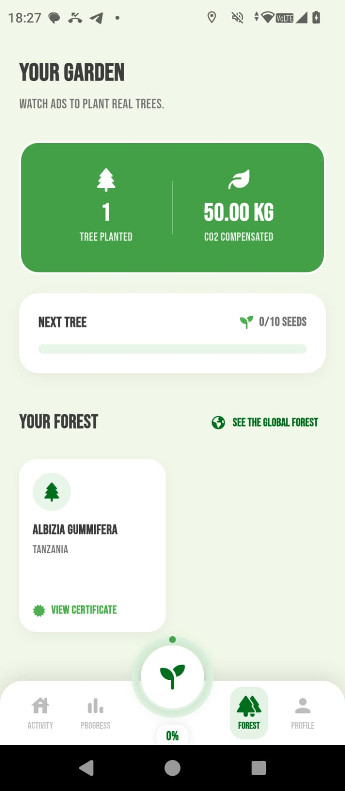<br><sub>Jardim pessoal</sub></td>
  </tr>
  <tr>
    <td align="center">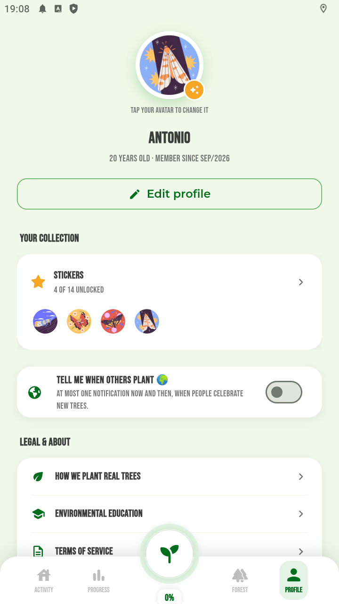<br><sub>Perfil</sub></td>
    <td align="center">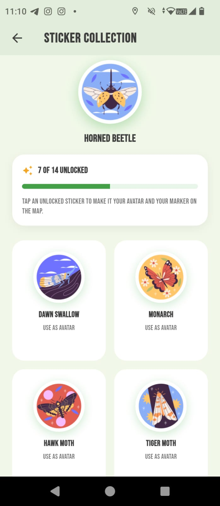<br><sub>Coleção de adesivos</sub></td>
    <td align="center">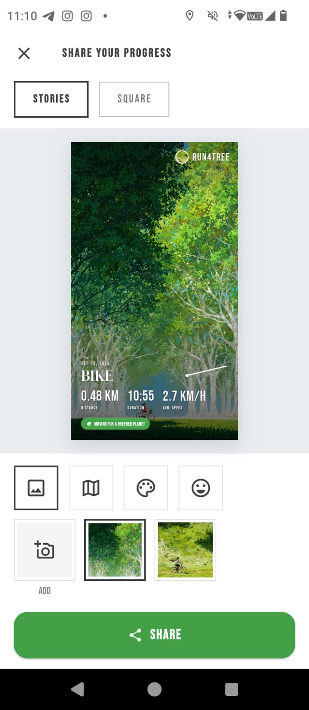<br><sub>Compartilhamento</sub></td>
  </tr>
  <tr>
    <td align="center">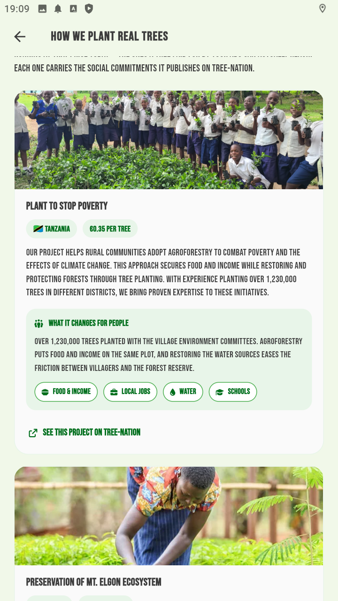<br><sub>Projeto na Tanzânia</sub></td>
    <td align="center">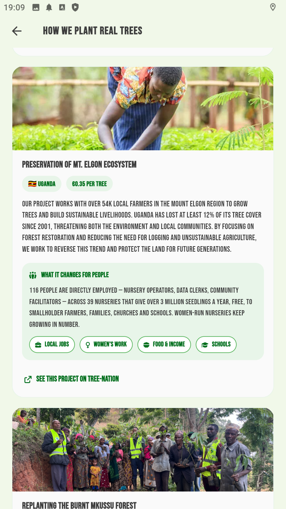<br><sub>Projeto em Uganda</sub></td>
    <td align="center">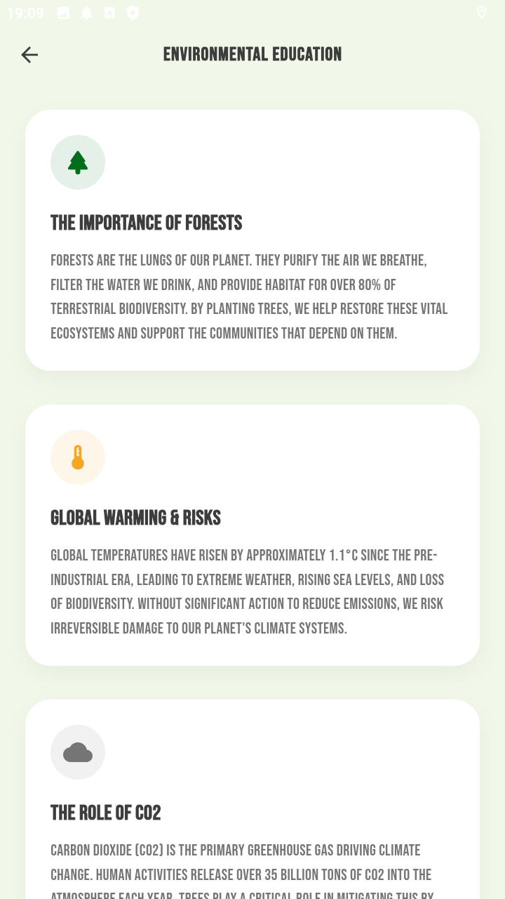<br><sub>Educação ambiental</sub></td>
  </tr>
  <tr>
    <td align="center">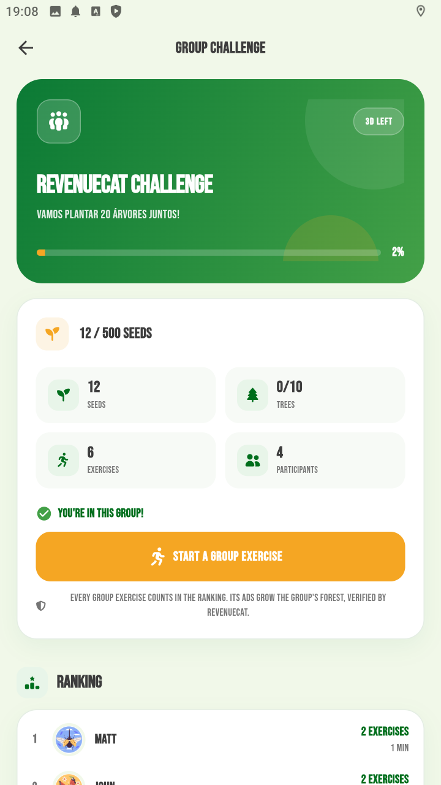<br><sub>Desafio em grupo — versão oficial</sub></td>
    <td align="center">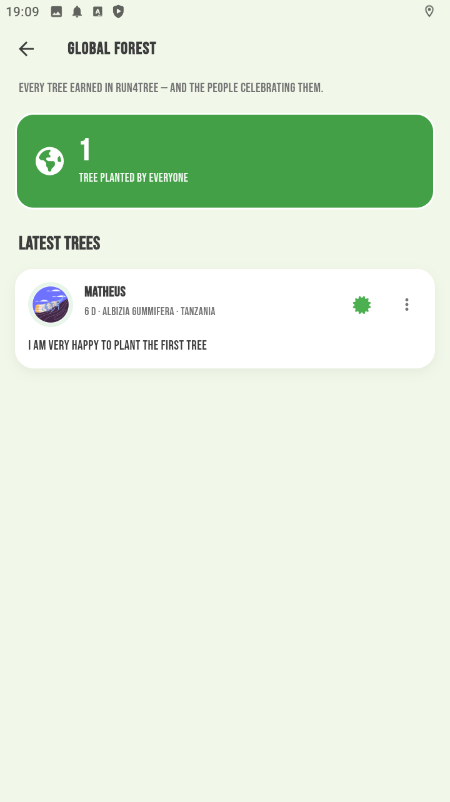<br><sub>Floresta global — versão oficial</sub></td>
    <td></td>
  </tr>
</table>

## O que está disponível

- registro de corrida, caminhada e ciclismo com GPS;
- mapa da rota, tempo, distância, ritmo, velocidade e calorias;
- histórico, detalhes, estatísticas e recordes dos exercícios;
- funcionamento offline com banco local Drift/SQLite;
- jardim pessoal com sementes, árvores pendentes, árvores plantadas e certificados;
- anúncios recompensados e banners que alimentam o progresso individual;
- compartilhamento do resultado e da rota da atividade;
- perfil, onboarding e coleção de adesivos/conquistas;
- clima, notificações de plantio e telemetria opcional.

## Escopo da edição open source

Para manter uma base pública menor e mais simples, esta edição não inclui:

- floresta global, feed e publicações sociais;
- desafios, exercícios e rankings em grupo;
- infraestrutura de backend e painéis administrativos usados em produção.

As integrações externas foram implementadas de forma defensiva: quando uma configuração opcional não está disponível, o app preserva os dados locais e desativa apenas o recurso dependente dela. O plantio real, porém, depende de um backend compatível com o contrato das Cloud Functions usado pelo aplicativo.

## Arquitetura

O código é organizado por funcionalidades em `lib/features`, seguindo separação entre apresentação, domínio e dados. Serviços compartilhados, banco local, tema e utilitários ficam em `lib/core`.

```text
lib/
├── core/                 # banco, serviços, tema e utilitários
├── features/
│   ├── auth/             # entrada no app
│   ├── onboarding/       # perfil inicial
│   ├── home/             # mapa e acompanhamento da atividade
│   ├── runs/             # sessões e conclusão da atividade
│   ├── exercises/        # histórico e estatísticas
│   ├── garden/           # sementes e árvores pessoais
│   ├── profile/          # perfil e conteúdo institucional
│   ├── share/            # cartão de compartilhamento
│   └── stickers/         # conquistas e avatar
└── l10n/                 # internacionalização
```

## Tecnologias principais

- Flutter e Dart;
- Drift/SQLite para persistência local;
- Google Maps e Geolocator para mapa e GPS;
- Firebase Auth, Firestore e Cloud Functions para serviços remotos;
- Google Mobile Ads e RevenueCat para o fluxo de receita;
- OneSignal para notificações;
- Sentry para observabilidade.

## Pré-requisitos

- Flutter compatível com Dart `^3.9.2`;
- Android Studio ou Xcode configurado para a plataforma desejada;
- uma chave do Google Maps;
- configuração própria do Firebase para usar autenticação, sincronização e plantio remoto.

O foco atual do aplicativo é Android e iOS. As demais pastas de plataforma são mantidas pelo Flutter, mas podem exigir configuração adicional das integrações nativas.

## Como executar

1. Clone o repositório e entre na pasta do projeto.

2. Instale as dependências:

   ```bash
   flutter pub get
   ```

3. Crie o arquivo local de ambiente a partir do exemplo:

   macOS/Linux:

   ```bash
   cp .env.example .env
   ```

   Windows PowerShell:

   ```powershell
   Copy-Item .env.example .env
   ```

4. No Android, adicione ao arquivo `android/local.properties`:

   ```properties
   GOOGLE_MAPS_API_KEY=sua_chave_do_google_maps
   ADMOB_API_KEY=ca-app-pub-3940256099942544~3347511713
   ```

   O valor de AdMob acima é o App ID oficial de teste para Android. Use IDs próprios antes de distribuir o aplicativo.

5. Configure um projeto Firebase seu e adicione os arquivos nativos, que não são versionados:

   - Android: `android/app/google-services.json`;
   - iOS: `ios/Runner/GoogleService-Info.plist`.

   Ative a autenticação anônima caso pretenda usar o fluxo remoto de plantio.

6. Execute o app:

   ```bash
   flutter run
   ```

Para explorar a interface sem anúncios reais, defina `DEMO_ADS=true` no `.env`. Nunca inclua segredos nesse arquivo: ele é empacotado junto com o aplicativo.

## Qualidade e testes

```bash
flutter analyze
flutter test
```

Os testes cobrem regras de adesivos, exercícios, compartilhamento, projetos de reflorestamento, persistência e fluxos relacionados ao plantio.

## Observações sobre produção

- substitua IDs de teste do AdMob antes de publicar;
- mantenha tokens privados e credenciais administrativas somente no backend;
- revise as políticas de privacidade e os textos legais para a sua distribuição;
- configure regras, índices e funções do Firebase de acordo com o seu próprio backend;
- valide permissões e chaves separadamente em Android e iOS.

Contribuições são bem-vindas por meio de issues e pull requests.
